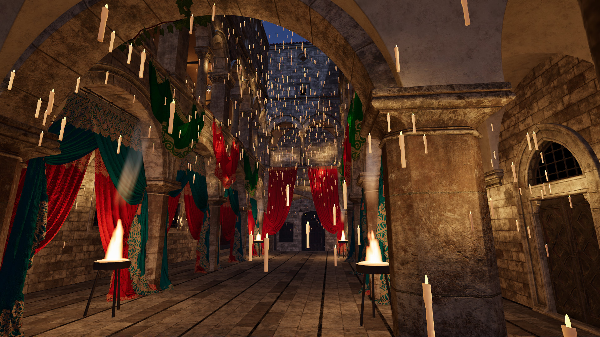
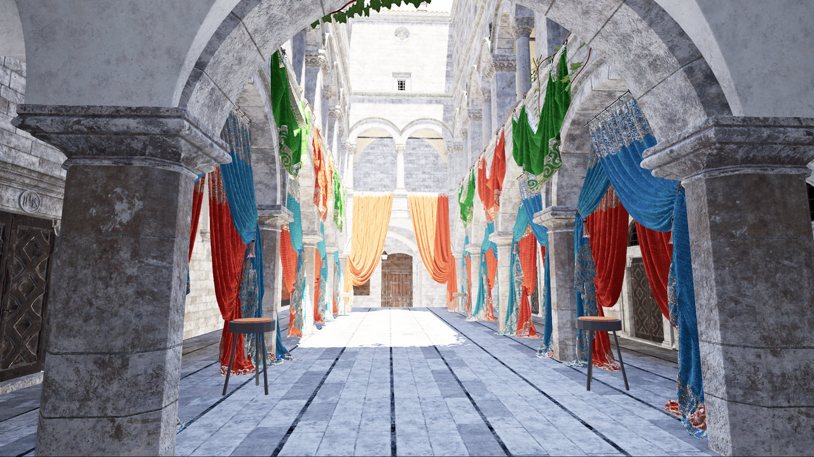
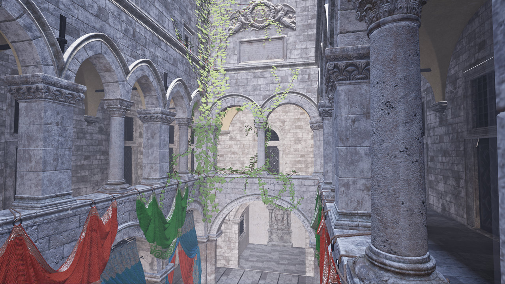
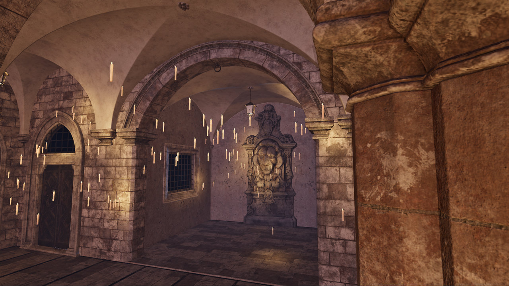
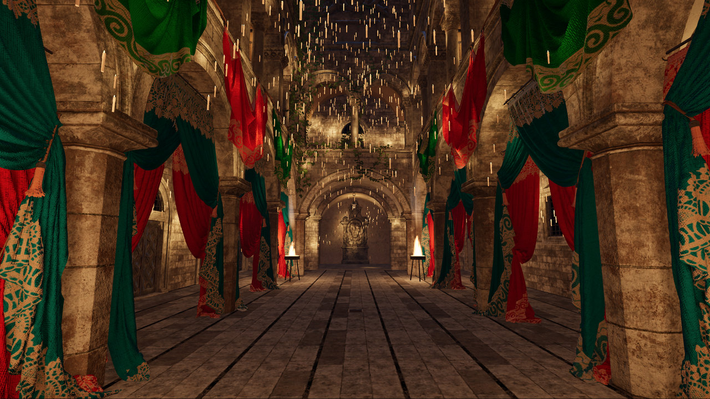
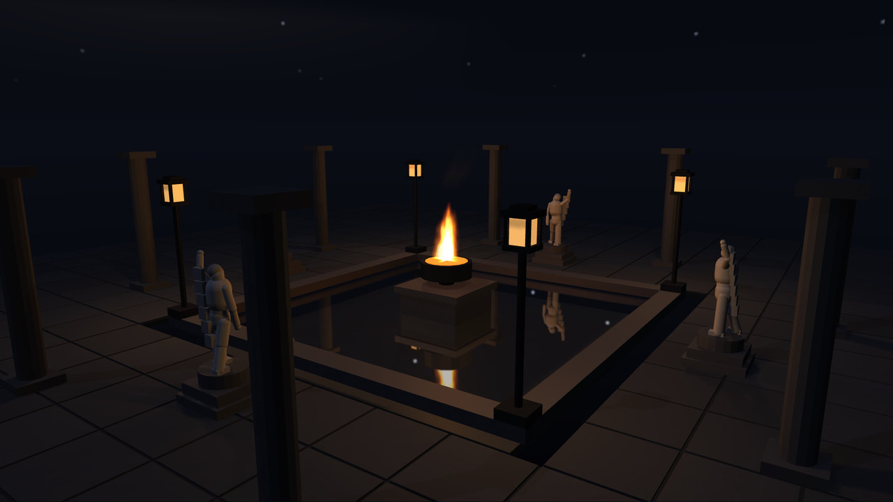

<p align="center">
  
</p>

<p align="center">
  <a href="https://www.npmjs.com/package/@driftengine/core"></a>
  <a href="https://www.npmjs.com/package/@driftengine/core"></a>
  <a href="https://www.npmjs.com/org/driftengine"></a>
  <a href="packages/core/README.md"></a>
  <a href="LICENSE"></a>
  <a href="https://github.com/drftrun/driftengine/actions/workflows/test.yml"></a>
  <a href="https://driftengine.dev"></a>
  <a href="https://discord.gg/UrHMg4pAT6"></a>
</p>

DriftEngine is a 3D game engine written in strict TypeScript. It draws through WebGPU, and through
WebGL2 wherever a browser has no usable device. The same game ships as a web page and as an
installed application for Linux, Windows, macOS and Android.

**Nothing in it decides what your game is.** There is no character type, no level format, no HUD.
The API takes positions, colours, sizes and time, so what you build keeps its own shape, and a piece
you outgrow is a piece you replace. The engine is split into packages a game installs one at a time;
`@driftengine/core` alone pulls in nothing optional, and tests on every push hold every package to
the dependencies it declares.

<p align="center">
  
</p>

<table>
  <tr>
    <td width="50%"><br><sub><b>Noon.</b> The sun at its height, the shade lit by what it bounces.</sub></td>
    <td width="50%"><br><sub><b>Golden hour.</b> The low sun on the upper storey, from the gallery.</sub></td>
  </tr>
  <tr>
    <td width="50%"><br><sub><b>Blue hour.</b> The sky gone, the first candles taking over.</sub></td>
    <td width="50%"><br><sub><b>Night.</b> Every candle lights, down to the far end.</sub></td>
  </tr>
</table>

Intel's Sponza (2022) through one midsummer day, drawn in a browser on WebGPU from
[`demo/sponza.ts`](demo/sponza.ts). The model is not in this repository; [`CREDITS.md`](CREDITS.md)
names it.

<table>
  <tr>
    <td width="33%"><br><sub><b>A city at dusk.</b> GPU-driven, culled per cluster.</sub></td>
    <td width="33%"><br><sub><b>Night court.</b> Fire, lanterns, point shadows and a reflecting pool.</sub></td>
    <td width="33%"><br><sub><b>Storm at sea.</b> A lighthouse beam through the fog.</sub></td>
  </tr>
</table>

These three are procedural and ship with the repository: `npm run demo` opens them.

## What it does

**Rendering**

- **Two backends, one picture.** WebGPU by default and WebGL2 beneath it, behind one API. A device
  is accepted by drawing a probe frame and reading it back, not by asking whether it exists, and a
  refused one falls back with the reason in words.
- **Light with a shape.** Directional, clustered point and spot lights with IES profiles and
  cookies, rectangular area lights whose shadows have the emitter's penumbra, spherical-harmonic
  irradiance and a GGX-prefiltered specular chain.
- **DriftLight** sums a scene's thousands of fixed lights once into an occluded sparse volume that
  stands in wherever the frame's own lights do not reach: within 5% of exact shading, for 0.3 to
  0.4 ms at 1440p.
- **DriftRay** traces bounced light on WebGPU, marching rays through a signed distance field of the
  scene in compute into the probe volume the shading already reads. Held to a path tracer.
- **DriftTR** draws the world at the output size divided by 1.3 to 2 and reconstructs it from a
  jittered history, refusing the history wherever depth, motion or normals say it is another surface.
- **A GPU-driven pipeline**, opt-in on WebGPU: instance and cluster culling, a depth reduction, a
  visibility buffer and material binning, each pass checked against a TypeScript reference on a
  device.
- **A frame that behaves like a camera**: metered and local exposure, ambient occlusion, temporal
  antialiasing, bloom, depth of field, motion blur, tone mapping and a colour grade.
- **Air, water and weather**: a sky and celestial clock that follow a latitude and a season, height
  fog, one wind every system samples, rain that stops under a roof, light shafts through a medium,
  Gerstner water, planar and screen-space reflection, refraction, and order-independent
  transparency.
- **Crowds and big scenes**: instanced batches that cull, crowds animated from bone textures in the
  vertex stage, static draws recorded once into render bundles, and worlds larger than a float whose
  simulation never rebases.
- **Textures a phone samples**: BC, ETC2, EAC and ASTC blocks upload as they are; a KTX2 file passes
  through as its blocks; and a BC texture loaded on a device without BC is re-encoded as ETC2 in a
  worker and swapped in behind the handle it was drawn with.

**Simulation and play**

- **Deterministic by construction**: a fixed-step loop, a seeded generator whose sequence is frozen,
  and physics with a per-tick fingerprint, so a replay is the same run and a desync names the tick
  it began at.
- **Physics**: rigid bodies, seven joint types, ray and shape queries, sensors, a character
  controller, a raycast vehicle, ragdolls, and cloth with two-way coupling.
- **Animation**: skeletons, blend trees, two-bone IK, morph targets, retargeting, and secondary
  motion sampled at any time, so it scrubs backwards with the playhead.
- **Everything around a game**: input from every device through one action map, cameras that cut,
  audio buses with placed sounds and rooms, entities and prefabs, navigation meshes, lockstep and
  rollback netcode, a 2D layer for sprites and menus, saves through a store the game supplies, and
  WebXR sessions.
- **DriftScript**, the engine's scripting language, compiled by the bundler, hot-reloaded in place,
  and bound to the engine through `drift/*` modules.

**Content**

- **`.drft`**, a streaming container that glTF, OBJ, STL, USD, 3MF, FBX and Blender files bake into: quantised meshes,
  instanced copies, textures kept as their blocks, and regions that stream nearest first. It took the
  courtyard above from 1.67 GB to 355 MB.
- **Gaussian splats** drawn among meshes, **DriftTexture** materials decoded on the device, and
  **DriftCapture**, which turns a video clip into a walkable surface with colliders on the player's
  own machine.
- **Tooling**: an editor with undo, play-in-editor and a scrubber that runs the simulation
  backwards; in-game inspector, console and profiler panels; and a visual gate that photographs
  scenes over the DevTools protocol on the hardware GPU.

## Packages

**Twenty-three packages, and a consumer takes only what it uses:**

| Package                                                      | What it is                                                                                                     | Gzipped               |
| ------------------------------------------------------------ | -------------------------------------------------------------------------------------------------------------- | --------------------- |
| [`@driftengine/core`](packages/core/README.md)               | The runtime: loop, both renderers, cameras, input, scene graph, geometry and text. Re-exports physics          | **898.2 KB**          |
| [`@driftengine/physics`](packages/physics/README.md)         | Rigid bodies, joints, queries, a character controller, a vehicle, ragdolls and cloth. Imports nothing else     | **47.0 KB**           |
| [`@driftengine/animation`](packages/animation/README.md)     | Skeletons, clips sampled at a time you supply, blend trees, IK, morph targets and spring secondary motion      | **6.1 KB over core**  |
| [`@driftengine/audio`](packages/audio/README.md)             | Buses and stems, placed sounds, rooms, synthesis and rhythm analysis                                           | **6.3 KB over core**  |
| [`@driftengine/assets`](packages/assets/README.md)           | Model readers, the streaming loader, KTX2, and ETC2 encoding for phones                                        | **27.2 KB over core** |
| [`@driftengine/drft`](packages/drft/README.md)               | The `.drft` container. Declares no runtime dependency                                                          | **14.3 KB**           |
| [`@driftengine/splats`](packages/splats/README.md)           | Gaussian splat captures: readers, view-dependent colour, an off-frame sort and a pass among meshes             | **16.8 KB over core** |
| [`@driftengine/texture`](packages/texture/README.md)         | DriftTexture: a material as a latent and a decode program sampled on the device, in content-addressed tiles    | **2.3 KB**            |
| [`@driftengine/capture`](packages/capture/README.md)         | DriftCapture: a video to a surface, colliders, a navigation mesh and proposed entities, on the player's device | **71.3 KB**           |
| [`@driftengine/terrain`](packages/terrain/README.md)         | Heightfields whose patches meet at different detail without cracks, and a query that answers the drawn surface | **1.3 KB over core**  |
| [`@driftengine/nav`](packages/nav/README.md)                 | Navigation meshes baked from geometry, and paths funnelled across them                                         | **8.8 KB**            |
| [`@driftengine/ui2d`](packages/ui2d/README.md)               | Batched sprites, sheets, tilemaps, and an interface tree with layout, focus and input routing                  | **10.0 KB over core** |
| [`@driftengine/entities`](packages/entities/README.md)       | Entities with generational identity, components, queries, systems, prefabs and scenes                          | **0.9 KB**            |
| [`@driftengine/network`](packages/network/README.md)         | One rewind core for lockstep and prediction, a transport seam, and desyncs named by tick. No renderer          | **2.4 KB**            |
| [`@driftengine/script`](packages/script/README.md)           | The `drift/*` bindings that describe the engine to DriftScript                                                 | **40.3 KB over core** |
| [`@driftengine/chemistry`](packages/chemistry/README.md)     | Thermochemistry of bulk matter: heat, phase changes, burning, an atmosphere and smoke                          | **18.1 KB**           |
| [`@driftengine/ai`](packages/ai/README.md)                   | Provider-neutral agent sessions, typed tools and budgets, with a loop that never waits on a provider           | **1.7 KB**            |
| [`@driftengine/xr`](packages/xr/README.md)                   | WebXR sessions, eye views and projections, controllers and hand joints                                         | **10.6 KB**           |
| [`@driftengine/editor`](packages/editor/README.md)           | The model of a scene editor: a tree, a schema-driven inspector and play-in-editor. No renderer                 | **10.4 KB**           |
| [`@driftengine/tools`](packages/tools/README.md)             | The inspector, console, profiler and network panel a shipped game can carry, over an undo stack                | **5.6 KB**            |
| [`@driftengine/media`](packages/media/README.md)             | Clip encoding and frame delivery. Carries `mp4-muxer` so core does not                                         | **11.3 KB**           |
| [`@driftengine/package`](packages/package/README.md)         | Turns a built game into an installable Linux, Windows, macOS, Android or iOS application                       | **a build tool**      |
| [`@driftengine/native-host`](packages/native-host/README.md) | The engine on a native window and device — Node, Dawn and SDL — for the packager's native target               | **a Node host**       |

The sizes are the floors `scripts/size-gate.test.mjs` asserts, measured from a real bundle, and
`scripts/packages.test.mjs` fails when this table disagrees with them or with the directory.

**DriftScript is its own package on its own version line**:
[`driftscript`](https://www.npmjs.com/package/driftscript), MIT, from
[drftrun/driftscript](https://github.com/drftrun/driftscript), with an editor client on the
[Visual Studio Marketplace](https://marketplace.visualstudio.com/items?itemName=DriftTech.driftscript-vscode).
This engine pins it exactly. Every `drift/*` module the language specifies is described here but
two: `drift/core`, whose provider is the loop that runs a script, and `drift/prefab`, whose one
function is named `spawn`, a keyword no import list can hold — `ecs.instantiate` makes an entity
from a prefab instead. The linker refuses an unprovided module by name at link time.

## Getting started

```sh
npm install @driftengine/core
```

**Start from [`examples/`](examples/README.md)**: small runnable programs, one capability each,
from a single lit mesh to a complete 3D game. `npm run examples` serves them. The smallest,
`examples/starter`, is also the quickstart in [`@driftengine/core`'s README](packages/core/README.md),
and the manual at [driftengine.dev/docs](https://driftengine.dev/docs) runs an example beside every
chapter.

Import from the package barrels and nothing deeper: `@driftengine/core` is the whole public surface
of the runtime. The packages resolve to compiled JavaScript by default, so any bundler and Node
itself take them as they are.

**To develop against a checkout of the engine**, depend on it by path and name the `drift-source`
condition, so your bundler reads the engine's TypeScript and an edit is live without a build:

```json
"dependencies": { "@driftengine/core": "file:../driftengine/packages/core" }
```

```js
// vite.config.js
import { defaultClientConditions, defineConfig } from 'vite';

export default defineConfig({
  // Spread, because `conditions` replaces Vite's defaults rather than extending them.
  resolve: { conditions: ['drift-source', ...defaultClientConditions] },
});
```

Taking the source needs `allowImportingTsExtensions: true` in the tsconfig that typechecks your
project, because the packages' relative imports name `.ts` files.

## Shipping

The same build ships in a tab and as an installed application. `drift-package` wraps a web bundle
in a desktop shell around a bundled Chromium, an Android APK around the system WebView, or an iOS
host, from one manifest; its native target runs the engine on Dawn and SDL with no browser at all.

```sh
npx drift-package doctor                     # what is configured, and how each target would sign
npx drift-package bootstrap                  # fetch the toolchain each target needs
npx drift-package build --target=linux-x64
```

[`docs/SHIPPING.md`](docs/SHIPPING.md) is the route from a web build to a store, and
[`packages/package/README.md`](packages/package/README.md) is the reference under it.

## Documentation

| Document                                             | Its one job                                                                         |
| ---------------------------------------------------- | ----------------------------------------------------------------------------------- |
| [driftengine.dev/docs](https://driftengine.dev/docs) | The manual and the API reference, with a running example beside every chapter       |
| [`CAPABILITIES.md`](docs/CAPABILITIES.md)            | What the engine does and does not do, with a test behind every absent row           |
| [`HANDBOOK.md`](docs/HANDBOOK.md)                    | Working with imported models, and what to do when one comes out wrong               |
| [`ARCHITECTURE.md`](docs/ARCHITECTURE.md)            | The package split, the boundaries, and the rules every package obeys                |
| [`RENDERING.md`](docs/RENDERING.md)                  | How the picture is made, and the approaches each effect tried and dropped           |
| [`FORMAT.md`](docs/FORMAT.md)                        | The `.drft` container specification, and which model formats are read at which tier |
| [`SHIPPING.md`](docs/SHIPPING.md)                    | Turning a web build into an installed application                                   |
| [`PORTING.md`](docs/PORTING.md)                      | Upgrading across a major release                                                    |
| [`ROADMAP.md`](docs/ROADMAP.md)                      | What comes next, in what order, and why                                             |
| [`IMPROVEMENTS.md`](docs/IMPROVEMENTS.md)            | Findings that are measured and not yet taken                                        |

Each package's README carries its full surface. The release notes are in
[`packages/core/CHANGELOG.json`](packages/core/CHANGELOG.json), and `npm run changelog` prints them.

## What does not exist yet

Absent rather than hidden behind an API that answers nothing. Each bullet names one row of
[`docs/CAPABILITIES.md`](docs/CAPABILITIES.md), whose sentinel turns the suite red on the day the
work lands.

- Screen-space GI: one bounce traced against the frame's own depth and colour. A probe grid
  carries the static bounce today.
- A fitted LTC table for an area light's specular. The highlight is an analytic integral over the
  rectangle; the fit exists, and uploading it as a table is unwritten.
- Learned reconstruction: a trained network refining the finished picture was tried and withdrawn,
  because on scenes it had not seen it did no better than a linear filter.
- Frame generation: no frames are synthesised between the ones the simulation produces.
- Tiled world streaming: a world is one container, streamed nearest first, rather than tiles
  fetched and dropped by distance.
- The native host on Windows and macOS: the Linux x64 target is built and measured.

**Written, and not yet run on the hardware it is for.** WebXR enters sessions and reads eye views,
controllers and hand joints, and drawing into a headset is not built: a session shows nothing inside
the headset yet. The iOS host is written and has never been compiled on a Mac.

**Declined.** `drift/core` and `drift/prefab` stay unbound for the reasons above, and chemistry
declines nine phenomena at the design — fluid dynamics, detonation and seven more — each with what
would reverse it recorded in the capability map.

## Development

```sh
npm install
npm run typecheck   # strict TypeScript, both configs
npm test            # vitest
npm run build       # each package's dist
npm run demo        # the scenes in demo/, one button each
```

[`AGENTS.md`](AGENTS.md) is the engineering doctrine this repository is held to: the game/engine
boundary, allocation-free hot paths, both backends for every rendering change, determinism, and few
tests that each protect a contract. [`CONTRIBUTING.md`](CONTRIBUTING.md) is what a change has to
satisfy. Questions and work in progress are welcome on [Discord](https://discord.gg/UrHMg4pAT6);
bugs belong in an issue here. Security reports follow [`SECURITY.md`](SECURITY.md).

To look at a model in the demo harness, bake it first; nothing under `models/` or
`demo/dev/public/` is committed:

```sh
npm run bake -- path/to/model.glb -o demo/dev/public/car.drft
```

## Licence

Apache-2.0 — see [`LICENSE`](LICENSE). Every dependency the browser engine ships is MIT or
Apache-2.0. The one copyleft package in the graph, `codec-parser` (LGPL-3.0-or-later, under the
native host's audio decoder), is never bundled: a packaged game carries it as a replaceable file
with the licence text beside it, and the packager refuses to bundle any copyleft library.

## Attribution

Distributing this engine or a work built on it means reproducing [`NOTICE`](NOTICE) — in your
source, your documentation, or a credits or licences screen. Every package barrel opens with that
line in the comment form a minifier keeps, so a bundle carries it without any work on your part.
Use it for anything, commercially included, and say where it came from.

**The boot badge is a request, not a condition.** A web build shows the engine's mark for three
seconds after its first frame, with the fixed loop held so nothing is spent behind it. `{ splash:
false }` or `?splash=0` turns it off, and the licence does not say otherwise; leaving it on is how a
new engine becomes known. [`CREDITS.md`](CREDITS.md) names everything here that came from
somewhere else.
