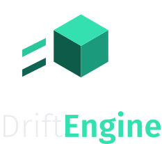

<p align="center">
  
</p>

# Examples

```sh
npm install
npm run examples      # http://localhost:5173
```

One capability each, small enough to read in a sitting. Every page reports which backend the
browser actually gave it, and every switch is a link rather than a click handler, because the
options they change are chosen when the renderer is built rather than per frame.

| Example                          | What it shows                                                                                       |
| -------------------------------- | --------------------------------------------------------------------------------------------------- |
| [`starter/`](starter/)           | A lit cube on a ground plane, in ninety lines. **The one to copy out** when beginning a project.    |
| [`game-2d/`](game-2d/)           | A whole game — paddle, ball, bricks, score, lives, win and loss — laid out in the XY plane.         |
| [`postprocess/`](postprocess/)   | Ambient occlusion, bloom, and the two settings bloom is useless without.                            |
| [`antialiasing/`](antialiasing/) | `sceneSamples` at 1 and at 4, on the edges where the difference is visible.                         |
| [`overlay-text/`](overlay-text/) | Screen-space panels and the built-in font, and the draw-order mistake that costs the whole overlay. |
| [`lines/`](lines/)               | Strokes with width in metres, an antialiased edge, and a buffer rewritten in place.                 |

## Starting a project from `starter/`

Copy the folder out of the repository and change two things:

1. Delete the `← all examples` link from `index.html`. It only exists for the served index.
2. Install what the example imports. Each package is taken separately:

   ```sh
   npm install @driftengine/core
   ```

   Or, to run against a checkout of the engine, point at it by path instead:

   ```json
   "dependencies": {
     "@driftengine/core": "file:../../driftengine/packages/core"
   }
   ```

`starter/` is the only example written to be copied. It carries its own boilerplate and imports
nothing from `common/`, so the file that ran is the file you get. The rest share
[`common/stage.ts`](common/stage.ts) so that each one is its subject and not twenty lines of
canvas plumbing repeated six times.

## The rules these examples obey

They are the engine's own rules, and an example that broke one would be teaching the wrong
lesson:

- **Only the public barrel.** Nothing reaches into `packages/core/src/…`. A picture built with
  privileged access argues for an engine nobody else has.
- **Nothing allocates in the frame loop.** Buffers are sized once and rewritten in place;
  `SceneNode`s are built up front and reused.
- **`alpha` is used, not ignored.** The simulation runs on a fixed step and the display does
  not, so anything that moves is interpolated between the last two states.
- **No game's nouns.** No example names a product, and a test in
  [`scripts/docs.test.mjs`](../scripts/docs.test.mjs) fails if one starts to.
