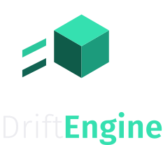

<p align="center">
  
</p>

# Examples

```sh
npm install
npm run examples      # http://localhost:5173
```

One capability each, small enough to read in a sitting. Every page reports which backend the
browser actually gave it. Every switch changes the running scene: a dial moves in the next frame,
and a quality option, which decides what the renderer allocates, builds a new renderer in place
while the scene carries on. The choice is kept in the address bar.

Where an example's behaviour can be a script, it is: `look/lens.drs`, `air/air.drs` and
`weather/weather.drs` are DriftScript, compiled by the dev server. Save one while its page is open
and the page keeps running with the new code.

| Example                          | What it shows                                                                                    |
| -------------------------------- | ------------------------------------------------------------------------------------------------ |
| [`starter/`](starter/)           | A lit cube turning at a rate a DriftScript rule sets. **The one to copy out** to start a game.   |
| [`first-game/`](first-game/)     | A complete 3D game: physics, a character, shadows, sound, a HUD, and its rules in DriftScript.   |
| [`game-2d/`](game-2d/)           | A whole game — paddle, ball, bricks, score, lives, win and loss — laid out in the XY plane.      |
| [`postprocess/`](postprocess/)   | Ambient occlusion, bloom, and the two settings bloom is useless without.                         |
| [`antialiasing/`](antialiasing/) | `sceneSamples` at 1 and at 4, on the edges where the difference is visible.                      |
| [`overlay-text/`](overlay-text/) | Screen-space panels and the built-in font, a keycap prompt, and a portrait in a box of its own.  |
| [`lines/`](lines/)               | Strokes with width in metres, an antialiased edge, and a buffer rewritten in place.              |
| [`materials/`](materials/)       | Image maps built in code, metalness and roughness, and the per-draw surface dials.               |
| [`instancing/`](instancing/)     | Ten thousand rocks in culled batches, and a batch rewritten every frame.                         |
| [`lights/`](lights/)             | Lamps that cast, a spot with a cookie, a photometric profile and a window that is an area light. |
| [`driftlight/`](driftlight/)     | Seven hundred candles, the sixteen nearest shaded exactly and the rest summed by DriftLight.     |
| [`driftray/`](driftray/)         | Bounced light traced on the GPU, following a wall that changes colour. WebGPU.                   |
| [`air/`](air/)                   | A sunbeam through a window, fire and smoke, and a medium that fills the room.                    |
| [`sky/`](sky/)                   | A day in ninety seconds: sun, moon, stars, clouds, and lamps that come on at dusk.               |
| [`weather/`](weather/)           | Fog, one wind, rain, lightning and puddles that mirror the street.                               |
| [`water/`](water/)               | The open sea under three winds, a planar reflection, and caustics under a pier.                  |
| [`look/`](look/)                 | Exposure, a colour grade, vignette, grain, a fade, depth of field and motion blur.               |
| [`drifttr/`](drifttr/)           | The scene drawn smaller and rebuilt to full size by temporal reconstruction. WebGPU.             |
| [`gpu-driven/`](gpu-driven/)     | 2,500 meshes culled and drawn by the GPU-driven pipeline. WebGPU.                                |
| [`particles/`](particles/)       | Sparks, smoke and motes from pools, emitted deterministically.                                   |
| [`picking/`](picking/)           | Hover and click: what is under the pointer.                                                      |
| [`terrain/`](terrain/)           | A valley drawn as a clipmap, painted and planted by rules in DriftScript.                        |
| [`streaming/`](streaming/)       | A town far from the origin, streamed in cells by prediction, with walkers that freeze and thaw.  |
| [`hlod/`](hlod/)                 | A city of 144 blocks drawn at the level of detail each one's distance deserves, crossfaded.      |
| [`kit/`](kit/)                   | A street built from copies of three pieces, as placements and expanded, with rules in a script.  |
| [`solids/`](solids/)             | A gatehouse built from closed solids, with windows and a doorway cut by booleans.                |
| [`splats/`](splats/)             | A rock garden of Gaussian splats, sorted off the frame, with geometry standing in it.            |
| [`drifttexture/`](drifttexture/) | Materials as programs decoded per pixel, one animated by the simulation's clock. WebGPU.         |
| [`scorch/`](scorch/)             | A wall a scripted turret scorches, with a clock that runs backwards and burns the marks again.   |
| [`capture/`](capture/)           | A synthesised clip of a room fused into a surface, proposed as entities, that balls land on.     |
| [`physics/`](physics/)           | A wall of crates, a ramp of rolling shapes, and a cannon scripted in DriftScript.                |
| [`joints/`](joints/)             | A bridge of hinged planks, a door on a motor, a swinging lamp and a breakable chain.             |
| [`queries/`](queries/)           | A laser casting rays, a sensor counting what stands on it, and a kinematic wall.                 |
| [`character/`](character/)       | A character controller in a valley of steps, a slab, a bridge and a pond.                        |
| [`vehicle/`](vehicle/)           | A raycast car on a ring of cones, driven by a DriftScript driver or by you, on tarmac or ice.    |
| [`ragdoll/`](ragdoll/)           | A ragdoll shoved down the stairs, a flag in a gusting wind, and a sheet dropped over a crate.    |
| [`animation/`](animation/)       | A figure walking a circle on a blend tree, reaching for a lantern, its pace set in DriftScript.  |
| [`navigation/`](navigation/)     | Villagers walking lanes in DriftScript, and dogs crossing a square on a mesh built from it.      |
| [`entities/`](entities/)         | Frogs catching fireflies over a pond, every rule a DriftScript system, with time that rewinds.   |
| [`chemistry/`](chemistry/)       | A campfire where everything heats at its own rate, with rain, wind and green wood scripted.      |
| [`agents/`](agents/)             | Villagers whose routines shelter from the rain and resume, and a crier who asks a model.         |
| [`models/`](models/)             | A turntable that reads glTF, OBJ and STL in a worker and streams them, or a model you drop.      |
| [`audio/`](audio/)               | A courtyard heard from the camera: a scripted bell, a muffled cart, lanterns on the kick.        |
| [`input/`](input/)               | A puck driven by keys, a gamepad or a thumb, a controls screen that rebinds, and rumble.         |
| [`cinematic/`](cinematic/)       | A buggy and a jump, cut by a scripted director, a cinematic as data, and a keyed path.           |
| [`sprites/`](sprites/)           | A tilemap garden and a gardener who picks its flowers, one sprite pass, in DriftScript.          |
| [`interface/`](interface/)       | A pause menu and options over a running scene: laid out, themed, clipped, in DriftScript.        |
| [`xr/`](xr/)                     | A headset across a room: its head, controllers and hand read each frame, a lamp on the trigger.  |
| [`saves/`](saves/)               | A garden bed that saves to a server that can fail, loads across a change, and keeps preferences. |
| [`recording/`](recording/)       | A still, a clip recorded as it plays, and one rendered frame by frame with its score.            |
| [`display/`](display/)           | A video settings screen drawn from what the host says it can do, and why where it cannot.        |
| [`tools/`](tools/)               | An inspector, a console and a profiler over a running game, and edits that undo.                 |
| [`netplay/`](netplay/)           | Two players in one match over a lossy link, rewinding when a guess was wrong, staying in step.   |

## Starting a project from `starter/`

Copy the folder out of the repository and change two things:

1. Delete the `← all examples` link from `index.html`. It only exists for the served index.
2. Install what the example imports. Each package is taken separately, and the cube's rate is a
   DriftScript rule, so the script binding and the language come with it:

   ```sh
   npm install @driftengine/core @driftengine/script driftscript
   npm install -D vite
   ```

   Or, to run against a checkout of the engine, point at it by path instead:

   ```json
   "dependencies": {
     "@driftengine/core": "file:../../driftengine/packages/core",
     "@driftengine/script": "file:../../driftengine/packages/script"
   }
   ```

   The folder's `vite.config.ts` compiles `spin.drs`, and `drs.d.ts` tells TypeScript what a `.drs`
   import is. Inside this repository the examples' own config does both.

`starter/` is the only example written to be copied. It carries its own boilerplate and imports
nothing from `common/`, so the file that ran is the file you get. The rest share
[`common/stage.ts`](common/stage.ts) so that each one is its subject and not twenty lines of
canvas plumbing repeated six times.

## The rules these examples obey

They are the engine's own rules, and an example that broke one would be teaching the wrong
lesson:

- **Only the public barrel.** Nothing reaches into `packages/core/src/…`. A picture built with
  privileged access argues for an engine nobody else has.
- **Nothing allocates in the frame loop.** Buffers are sized once and rewritten in place;
  `SceneNode`s are built up front and reused.
- **`alpha` is used, not ignored.** The simulation runs on a fixed step and the display does
  not, so anything that moves is interpolated between the last two states.
- **No game's nouns.** No example names a product, and a test in
  [`scripts/docs.test.mjs`](../scripts/docs.test.mjs) fails if one starts to.
- **A still beside each.** `still.webp` is what the site's gallery shows, captured on a real GPU
  by `node scripts/example-stills.mjs <name>`. A test in
  [`scripts/manual.test.mjs`](../scripts/manual.test.mjs) fails for an example without one, and an
  example that changes how it looks takes a new still in the same commit.
